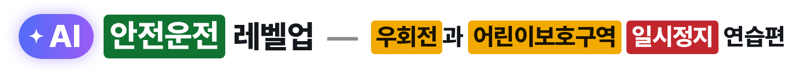
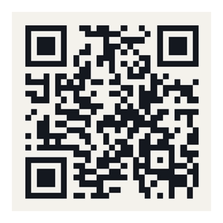
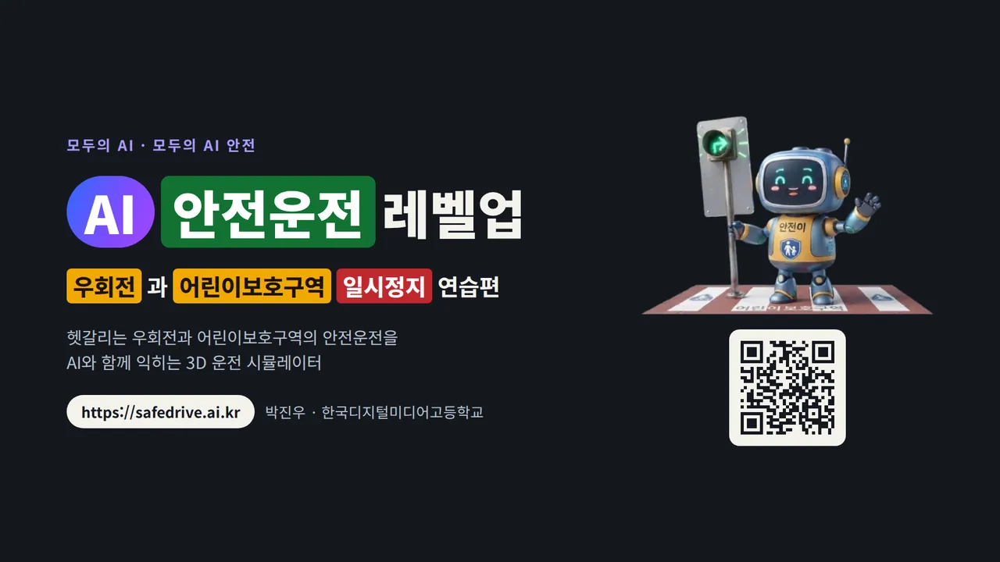

<h1>
  <picture>
    <source media="(prefers-color-scheme: dark)" srcset="docs/title-dark.png">
    
  </picture>
</h1>

이 프로그램은 교통법규 중 지키기 힘든 부분을 **AI의 도움을 받아서 훈련을 하는 프로그램**입니다.

아빠 차를 타며 헷갈리는 상황들을 많이 봤었습니다. 그리고 AI를 활용해서 훈련하는 곳을 만들면 많은 사람들이 교통법규도 잘 지키고 안전하게 운전을 할 수 있을 것 같아서 만들게 되었습니다.

AI를 통해서 안전한 도로가 되었으면 좋겠습니다. 아래 주소로 접속해서 안전운전을 연습해봐요.

> ※ **주의사항** : 현재 프로토타입 버전으로 교통법규에 대한 정확한 테스트 및 추가 기능 개발 예정입니다.
> 이 프로그램은 안전운전 습관을 연습하는 교육용 도구이지, 실제 도로 상황이나 현행 법령의 해석을 보장하지 않습니다.

<table>
  <tr>
    <td valign="middle">
      
<b>서비스 주소</b> : <a href="https://safedrive.ai.kr">https://safedrive.ai.kr</a>

      
<b>포트폴리오</b> : <a href="https://safedrive.ai.kr/AI_safelevelup_portfolio.html">https://safedrive.ai.kr/AI_safelevelup_portfolio.html</a>

      
휴대폰 카메라로 오른쪽 QR코드를 찍으면 설치 없이 바로 연습할 수 있습니다.

    </td>
    <td width="180" align="center" valign="middle">
       
      QR코드로 바로 접속
    </td>
  </tr>
</table>

---

※ 라이선스 — Copyright (c) 2026 goodpjw2008. All rights reserved.

소스코드의 사용을 원하시는 분은 이메일(goodpjw2008@gmail.com)로 요청해 주세요. 대부분 흔쾌히 허락해 드립니다. 무분별한 사용을 예방하려는 것이니 이해 부탁드립니다.

서비스 주소([https://safedrive.ai.kr](https://safedrive.ai.kr))에서는 자유롭게 안전운전을 연습하실 수 있습니다.
자세한 조건은 [LICENSE](LICENSE) 를 봐 주세요.

제가 다른 곳에서 가져다 쓴 3D 자동차 모델 · 효과음 · 환경광 · 글꼴 · 아이콘 · 오픈소스 라이브러리는 각 원작자의 라이선스를 그대로 따릅니다. 목록과 출처는 [THIRD_PARTY_NOTICES.md](THIRD_PARTY_NOTICES.md) 에 정리해 두었습니다.
